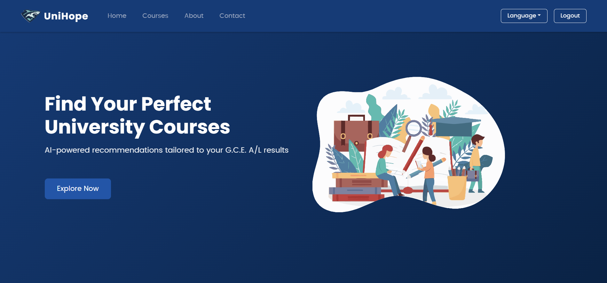
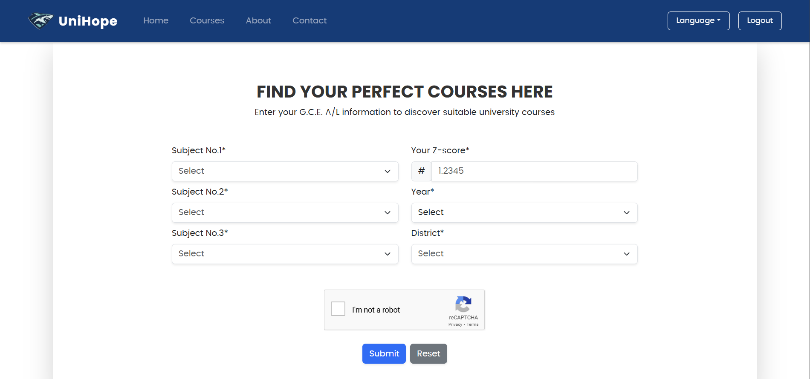
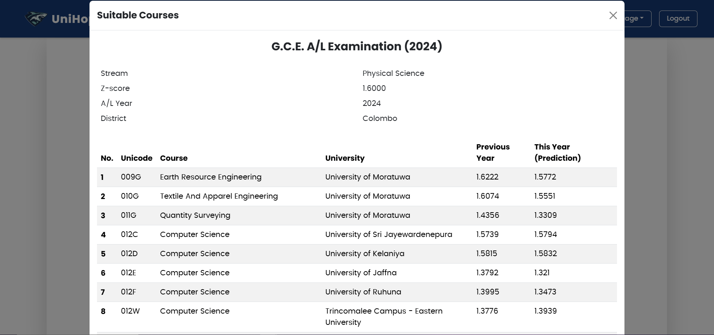
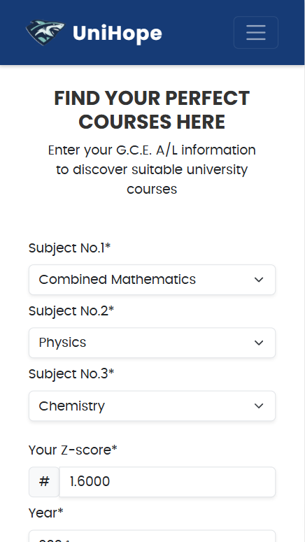
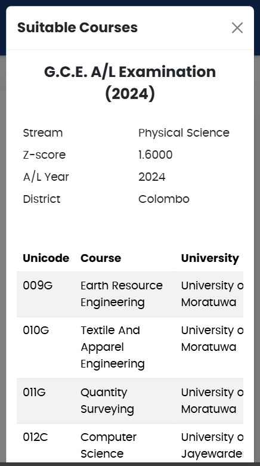

# UniHope Personalized State University Course Recommendation and Cutoff Prediction SaaS

## Overview

UniHope is an innovative AI-powered platform designed to assist Sri Lankan G.C.E Advanced Level students in their state university course selection process. UniHope analyzes students' academic profiles to provide personalized course recommendations, helping them make informed decisions about their higher education journey. UniHope's user-friendly interface and multi-language support ensure accessibility for all, while its advanced algorithms offer up-to-date insights on state university course cutoff predictions. At UniHope, we're committed to simplifying students' paths to the right state university course and empowering their academic future.

## Background & Research

UniHope aims to tackle an important issue that almost every Sri Lankan G.C.E Advanced Level student faces after they receive their exam results. The idea for this project came to us when we remembered how difficult it was to select a set of courses that is eligible for our subjects stream and also possible given our Z score. We felt that there was a real need for an efficient and innovative solution, and that's what we set out to build.

## Current Challenges

We noticed that around 300,000 students participate in G.C.E Advanced Level Examination per year, and more than half of them become eligible to enter state universities. However, most students face recurring issues in navigating the university admission handbook provided by the University Grants Commission in Sri Lanka. The process is time-consuming, often confusing, and particularly challenging for students with lower Z scores who frequently miss out on eligible courses due to lack of awareness and the handbook's complexity. It's not just about choosing courses; it's about making life-changing decisions under pressure, often without proper guidance or tools to help them understand their full range of opportunities.
Research Findings
Our research across social media platforms revealed thousands of students expressing their concerns about university admissions. From YouTube channels to Facebook pages, we analyzed these comments and identified four critical questions that students repeatedly ask every year:

1. "I studied Mathematics for A/Ls and my Z-score is 1.6550. Will I be able to get into an engineering course this year?"
2. "I completed A/Ls in the Arts stream with a Z-score of 0.1550. Can I qualify for any state university?"
3. "Which courses are available for my stream?"
4. "I missed my chance at university entrance because I wasn't aware of courses that matched my Z-score and stream."

## Solution Development

To address these challenges, we developed UniHope to automate this complex process. UniHope includes a machine learning model trained to predict cutoff Z scores for the upcoming year by analyzing historical data up to 10+ years and filtering out suitable courses for each student. What sets UniHope apart is its innovative approach to digitizing a complex manual task through modern technologies, ensuring a more effective and efficient solution. By developing UniHope, we aim to solve this long-standing problem for students and empower them to make informed decisions quickly and confidently, saving them time and reducing stress during a critical phase of their lives.

## Screeshots

|                          |
| :-----------------------------------------------------------: |
|                          _Home Page_                          |

|                          |
|    :-----------------------------------------------------------:    |
|                          _Search Page_                              |

|                          |
|    :-----------------------------------------------------------:    |   
|                          _Recommendations_                          |

## Features

- Supports multiple languages (Sinhala, English, Tamil)
- Utilizes machine learning to forecast course cutoff scores
- Provides detailed information about available university courses
- Tailors suggestions based on student’s academic profile
- Accessible across various devices (desktop, tablet, mobile)
- Processes student inputs and generates recommendations instantly

## Tech Stack

- Frontend: React.js
- Backend: Ballerina
- Database: PostgreSQL
- Machine Learning Model: Python, FastAPI

## Prerequisites

- Node.js and npm
- Ballerina
- Python 3.7+
- PostgreSQL

## Installation and Setup

### 1. Frontend Setup

```bash
cd frontend
npm install
```

Create a `.env` file in the frontend directory and add:
```
REACT_APP_RECAPTCHA_SITE_KEY=your_recaptcha_site_key_here
```

Start the frontend:
```bash
npm start
```

### 2. Backend Setup

Navigate to the backend directory:
```bash
cd backend
```

Create a `config.toml` file in the backend directory and add:
```
# Database Configuration
dbHost = ""
dbName = ""
dbUsername = ""
dbPassword = ""
dbPort = 

# Email Configuration
smtpHost = "smtp.gmail.com"
smtpUsername = ""
smtpPassword = ""

# Server Configuration
serverPort = 8080

# Model API Configuration
modelApiUrl = "http://localhost:8000"
```

Run the Ballerina server:
```bash
bal run
```

### 3. Machine Learning Model Setup

Navigate to the model directory:
```bash
cd model
```

Install required Python packages:
```bash
pip install -r requirements.txt
```

Start the FastAPI server:
```bash
python -m uvicorn cutoff_predictor:app --reload
```

## Usage

After setting up all components, access UniHope through `http://localhost:3000` in your web browser.

> Please be noticed that access has been intentionally limited to a smaller portion of our dataset. Testing is currently available for the following subjects: **Combined Mathematics, Biology, Physics, and Chemistry** and districts: **Colombo**.

<p align="center">
    
    
</p>

## Contributing

UniHope is currently in beta testing, with plans for a full release targeting 2024 G.C.E Advanced Level students. We're particularly focused on ensuring high accuracy in UniHope's predictions and developing additional features, as we understand the critical nature of these decisions in students' lives.

We warmly welcome contributions from the open-source community! If you'd like to contribute, please:

1. Fork the repository
2. Create your feature branch (`git checkout -b feature/AmazingFeature`)
3. Commit your changes (`git commit -m 'Add some AmazingFeature'`)
4. Push to the branch (`git push origin feature/AmazingFeature`)
5. Open a Pull Request

## License

Distributed under the MIT License. See `LICENSE` for more information.

## Contact

```
WhatsApp: (+94)758447545
```

## Acknowledgements

- [Ballerina](https://ballerina.io/)
- [React.js](https://reactjs.org/)
- [FastAPI](https://fastapi.tiangolo.com/)
- [scikit-learn](https://scikit-learn.org/)
- [PostgreSQL](https://www.postgresql.org/)